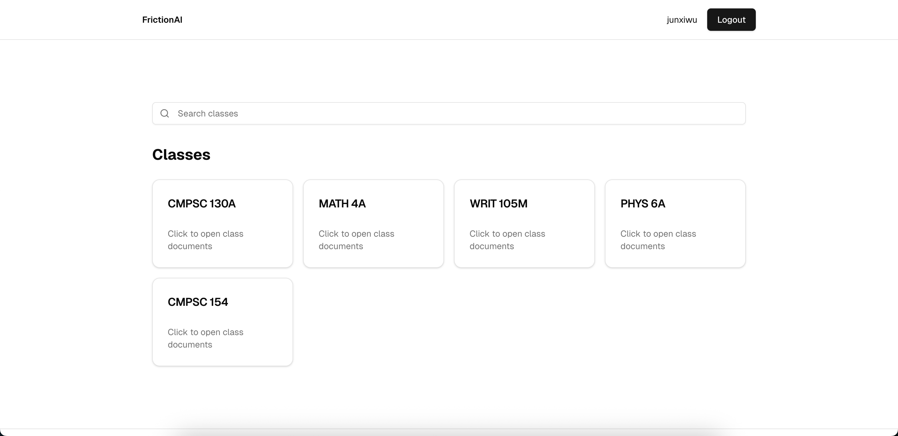

# FrictionAI

FrictionAI is an collaborative study tool for students and instructors 

Click any confusing text or diagram in your course materials to get an instant AI explanation tailored to your specific course and context. See visual heatmaps showing exactly where others struggle. Red hot zones indicate high-confusion areas, yellow shows moderate difficulty, and green means students get it. 

### Tech stack

**Frontend:** Next.js with React

**Backend:** Supabase 

**PDF Processing:** AWS Lambda for text extraction and labeling

**AI Layer:** Google Gemini 2.5 Flash API integrated into Supabase Edge Function

**Analytics:** Custom DBSCAN-inspired clustering algorithm that aggregates click coordinates into density blobs. We interpolate colors (green → yellow → red) using logarithmic scaling to make heatmaps visually meaningful

### Screenshots

